<h1>Case Study</h1>
 
At IJSE, all the GDSE students have a unique student id. Imagine that in the 1st semester of GDSE, they are supposed to take two mandatory modules, which are Programming Fundamentals and Database Management Systems. Students are supposed to face exams for these modules at the end of the semester.  
The instructors and lecturers require a system to manage student marks. As you are a new GDSE student, they have thought to give you a chance of making a system for them. 
 

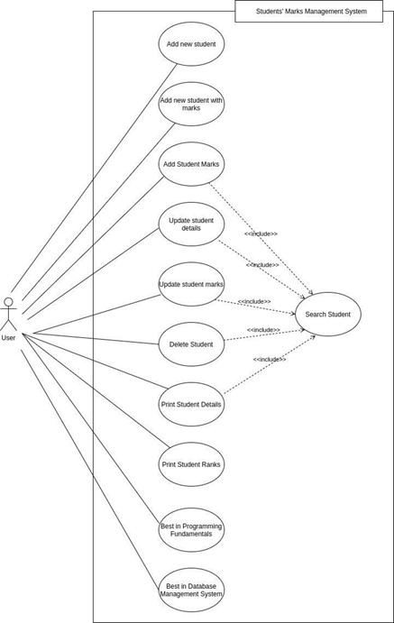
 
Figure 1 – Use case Diagram 
 

<h3>Requirement</h3>
You are supposed to create a Java application to manage these students’ marks. In the application, you need to implement the following use cases. 
When you run the application, you should come up with something similar to the following Command Line Interface (CLI), where the user can enter an option number that he wants to execute. This will be the Home Page of the application that you will be developing. 
 
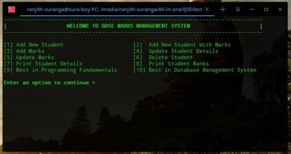
 
Figure 2 – Home Page of the GDSE Marks Management System 
 

1. Add New Student  
Adding a new student is easy. First, the user needs to enter the Student ID then Student Name. This is only for adding a new student, not for assigning marks. Once the user has added a new student successfully, a message should prompt to ask whether the user wants to add a new student again or to go back to the main menu. 
 
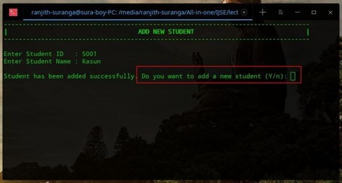
 
Figure 3 – Add New Student (Successful)
 

It is not allowed to add the same Student ID again. If the user has entered a student id that already exists, the user should be notified about it and asked to enter the correct Student ID again. This should keep prompting until the user enters a valid Student ID. 
 
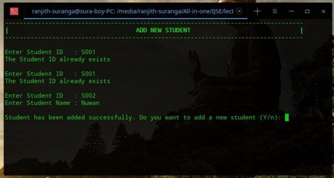
 
Figure 4 – Add New Student (Warning – already exist) 
 

2. Add New Student with Marks 
Previously the user can only add a new student, but with this option, not just the user can add a new student but marks too. When adding marks (assuming the user is only going to enter integer values), marks should be validated, which means marks should be within the range of 0-100. If the user has entered invalid marks (as an example, a negative number or a number greater than 100), the user should be kept prompting until he enters valid marks. Other than that, everything else is the same as above. 
  
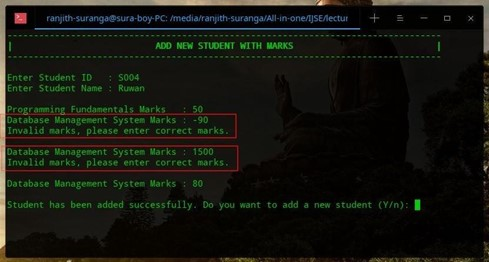
 
Figure 5 – Add New Student with Marks 
 

3. Add Marks 
If the user previously has entered student details only, then adding marks of these students can be done with this functionality. First, the user needs to find the student via Student ID. If the user has entered an invalid Student ID, then it should be notified to the user and asked whether to continue search or not. Until the user enters a correct student id, this should keep happening. Once the user has entered a valid Student ID, it should display the Student Name and ask for new marks. Again here, marks should be validated like previously. Once the correct marks have been entered, it should prompt whether to add marks for another student or go back to the main menu. 
 
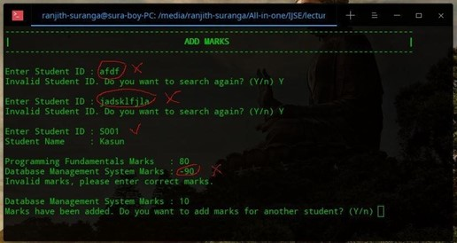
 
Figure 6 – Add Marks (with validation - 1)
 

If the user tries to enter marks for a student who has been assigned marks previously, it should be notified as well. This option is only available for the students whose marks still haven’t been given. 
 
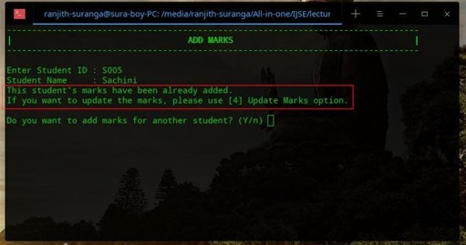
 
Figure 7 – Add Marks (with validation - 2)
  

4. Update Student Details 
With this option, the user can update existing student details (Student Name). First, the user should enter a valid Student ID. Otherwise, it should handle like previously. Once the user has entered a valid Student ID, it will display the current Student name and ask for the new student name. Once the data has been updated successfully, it should prompt whether to update another student’s details or go back to the main menu. 
  
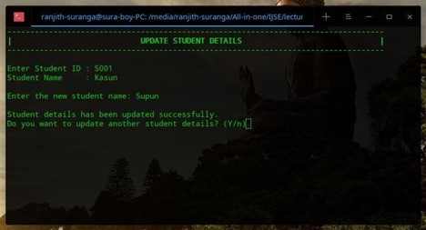
 
Figure 8 – Update Student Details 
 

5. Update Marks
With this, the user can update previously added marks. First, the user needs to find the student whose marks should be updated via Student ID. (Invalid Student IDs should be handled like previously) Once the user has entered a valid student ID, it is going to display the current details, which are the student’s name and the marks that have been added previously. Then it prompts for new marks. Again, marks should be validated here. Once the update has been done successfully, it should prompt whether to continue updating or go back to the main menu. 
 
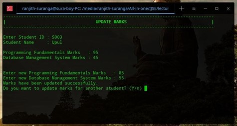
 
Figure 9 – Update Marks
  
If the user has entered a valid student id of a student whose marks still haven’t been added to the system, then it should be notified as well like follows. 
 
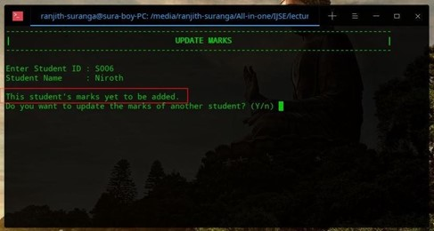
 
Figure 10 – Update Marks (validation) 
 

6. Delete Student 
With this option, a student can be deleted from the system. First, the user needs to enter the valid Student ID; otherwise, it should handle like previously. Once the user has entered a valid student id, the student can be deleted. Upon the successful deletion, the user should be prompted whether to delete another student or go back to the main menu. 
  
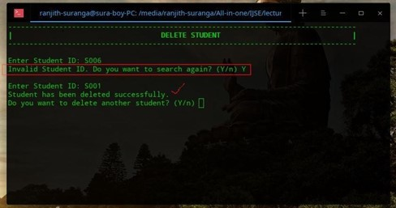
 
Figure 11 – Delete Student 
 
 	 
7. Print Student Details 
With this option, the user can view student details. First, he needs to enter a valid student id; otherwise, it should handle like previously. If the student marks haven’t been added yet, then they should be displayed like below. 
 
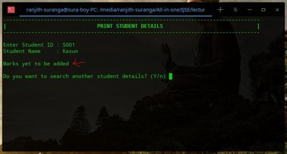
 
Figure 12 – Print Student Details (with validation) 
 
If the student marks have been already added, then a comprehensive detail table should be displayed, which contains the marks, total marks, avg. marks as well as the rank of the student. First, Second, Third, and Last rank positions are also displayed in text close to the rank number in parenthesis. Once the information has been displayed, the user should be prompted whether to continue seeking student details or go back to the main menu. 
  
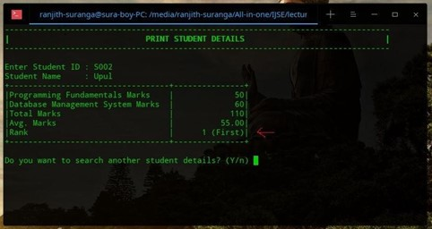
 
Figure 13 – Print Student Details (successful) 
 
Note: More information about rank can be found in the next step. 
 	 
8. Print Student Ranks 
This displays all the students with their ranks. The students whose marks have not been added to the system yet doesn’t display here. Apart from the ranks, their student Id, name, total marks, and avg. marks are also displayed here. It should prompt whether the user wants to stay in here or go back to the main menu. 
 
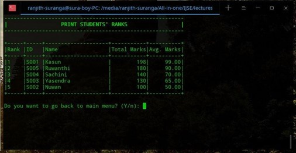
 
Figure 14 – Print Student Ranks
 

9. Best in Programming Fundamentals 
This displays who has done well in the Programming Fundamental module. Just like the previous one, only the students whose marks have been added take into the calculation. Just like above, in the end, it should prompt whether the user wants to stay in here or go back to the main menu. 
 
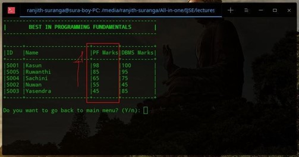
 
Figure 15 – Best in Programming Fundamentals
  
 	 
10. Best in Database Management System 
This displays who has done well in the Database Management System module. Just like the previous one, only the students whose marks have been added take into the calculation. Just like above, in the end, it should prompt whether the user wants to stay in here or go back to the main menu. 
  
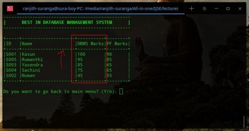
 
Figure 16 – Best in DBMS 
 

